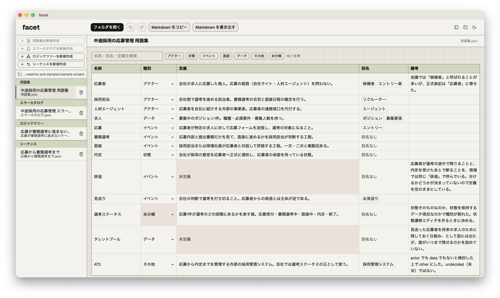
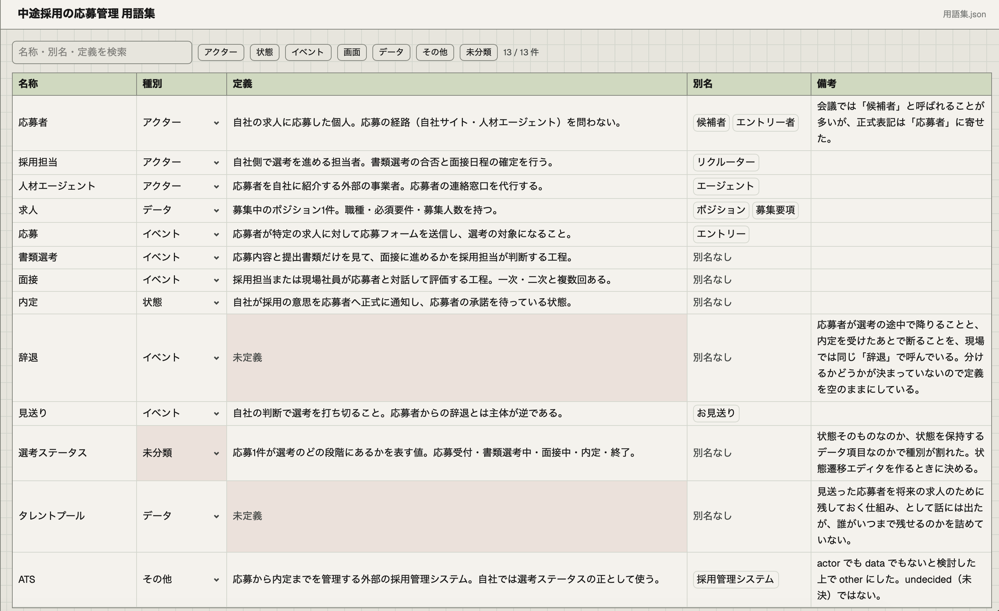
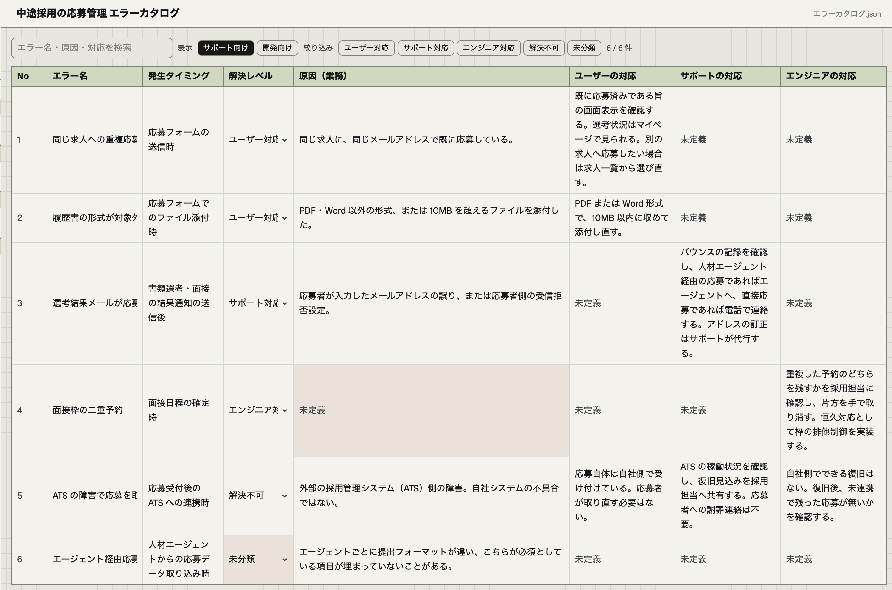
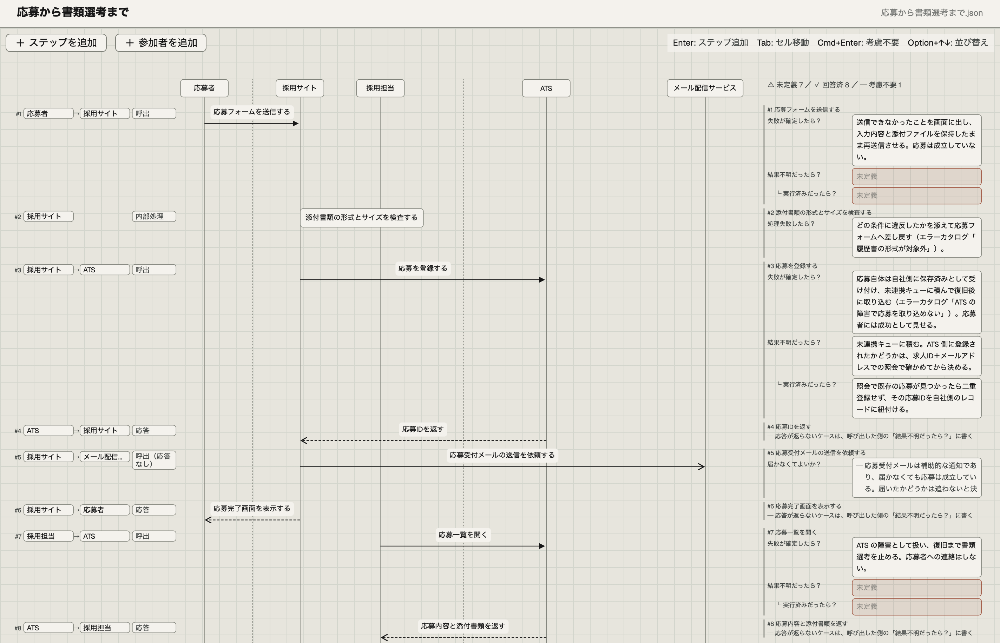
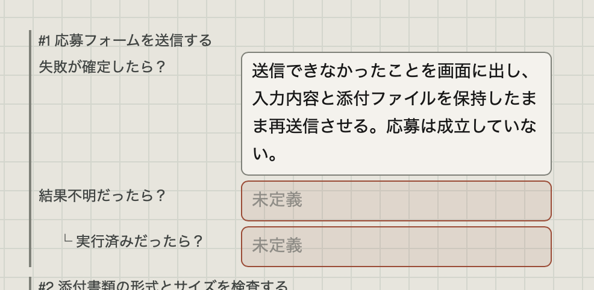
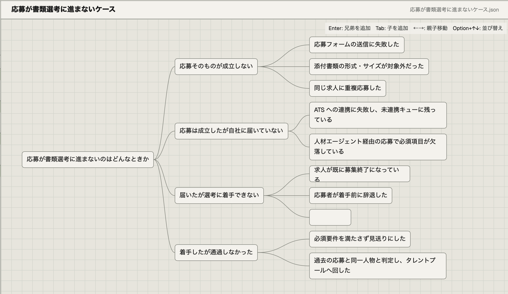
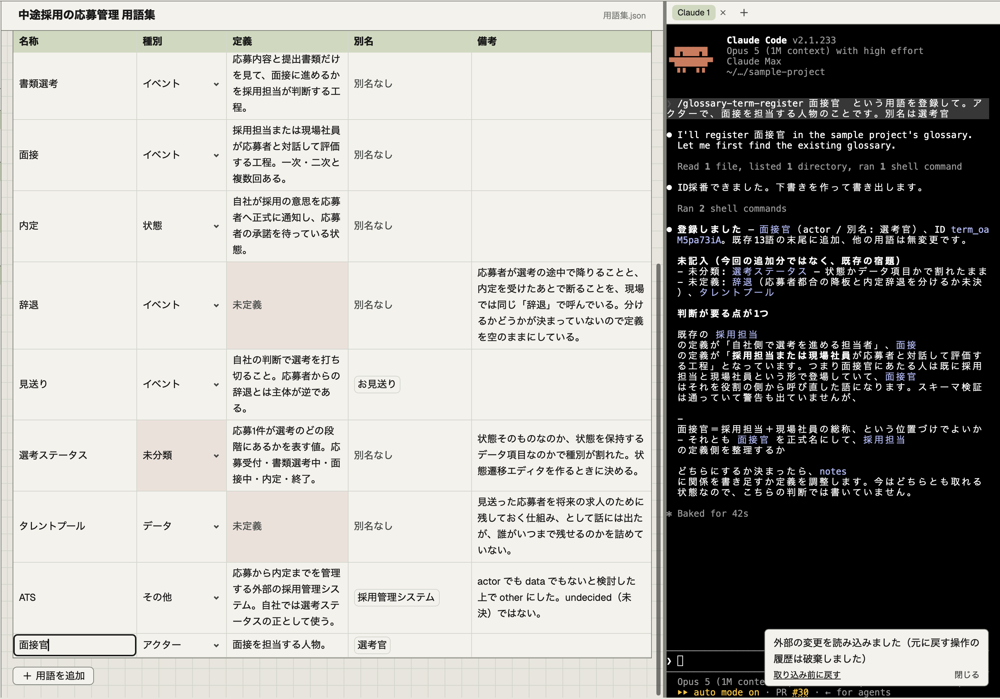
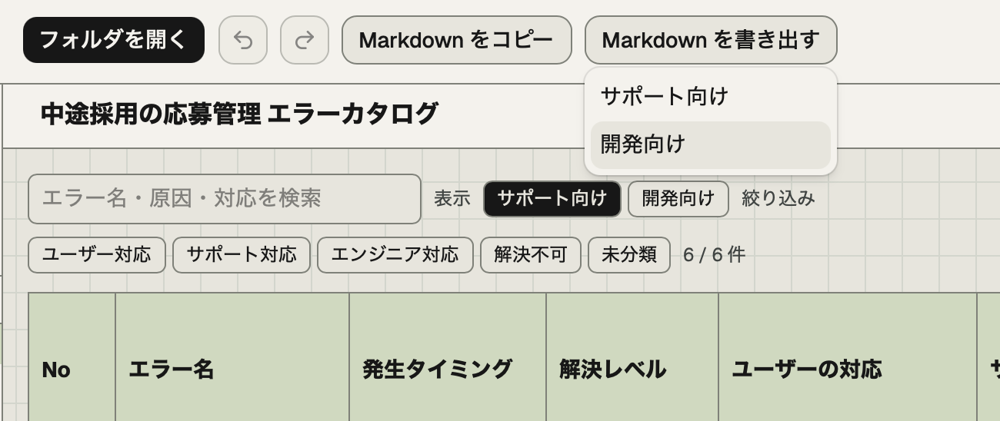

# facet

**会議の速さで仕様を打ち込み、決めていないことを消せなくするツール詰め合わせ。**

文字だけの仕様書は、分岐・時系列・状態・用語という多次元の情報を一次元の文章に潰している。読むたびに頭の中でグラフを組み直すことになるし、なにより **「まだ決めていない」と「決めた上でそうしない」が、どちらも「書いてない」に潰れる。**

facet は、人間が構造化された UI で入力し、ツールが網羅性の担保・描画・Markdown 出力を引き受ける。未決の箇所はデータの構造として残り、画面上で warning として見え続ける——**埋めない限り消えない。**

<!-- SCREENSHOT: hero.png
     撮り方: sample-project/ を開き、左のファイル一覧＋右に用語集エディタが出ている全体像。
             ウィンドウ全体を 1280x800 で。
     置き場所: docs/images/hero.png -->


デスクトップアプリ（Windows / macOS）。データは**プロジェクトフォルダの中の JSON ファイル**で、それが仕様の正。サーバも DB もアカウントも無い。

---

## 入っているツール

| ツール | 何を担うか | プロジェクト内の数 | Markdown 出力 |
| --- | --- | --- | --- |
| **用語集** | 用語の定義と表記ゆれ（別名）の管理。他ツールから参照されるハブ | 1つだけ | 1種類 |
| **エラーカタログ** | エラーの一覧と、**誰が解決するか**の整理。サポートチームへの引き渡しが主目的 | 1つだけ | サポート向け／開発向けの2種類 |
| **シーケンス** | 時系列の直列シナリオ。**全ステップに「失敗したら？」の問いが自動で立つ** | いくつでも | 1種類（Mermaid 図を含む） |
| **ロジックツリー** | 分岐・パターンの網羅 | いくつでも | なし |
| **課題ツリー** | PoC で「試さないと分からないこと」の分解と、仮説・検証の履歴。**ステータスを持たず、追記だけで現在が決まる** | いくつでも | なし |

状態遷移エディタが次の候補。ツールは増える前提の作りになっている。

### 用語集

`definition` が空なら「未定義」、`kind` が `undecided` なら「種別が未分類」として warning が出る。別名（aliases）は表記ゆれの照合キーで、会議で「候補者」と言われたものが「応募者」を指すと分かる。

<!-- SCREENSHOT: glossary-editor.png
     撮り方: sample-project/用語集.json を開いた状態。「辞退」と「タレントプール」の定義が空で
             warning が出ており、「選考ステータス」の種別が undecided になっているところが写るように。
     置き場所: docs/images/glossary-editor.png -->


### エラーカタログ

`resolutionLevel`（誰が解決するか）が要。**`none`＝検討した上で誰にも解決できない（確定）** と **`undecided`＝まだ決めていない（未決）** を型で分けてある。この2つを混ぜないことが、サポートに渡せる表とただのメモを分ける。

<!-- SCREENSHOT: error-catalog-editor.png
     撮り方: sample-project/エラーカタログ.json を開いた状態。「ATS の障害で応募を取り込めない」の none と、
             「エージェント経由応募で応募者情報が欠落する」の undecided が同じ画面に並ぶように。
     置き場所: docs/images/error-catalog-editor.png -->


### シーケンス

**異常系を矢印で描かない。** 描くのは正常系だけで、異常系は各ステップに立つ「失敗したら？」の問いへの答えとして持つ。どの問いが立つかは矢印の種類から決まる：

- 内部処理 → 「処理が失敗したら？」
- 応答を待つ呼出 → 「呼出が失敗したら？」＋「結果がわからなかったら？」（さらに「既に実行されていたら？」＝冪等性の問い）
- 投げっぱなしの呼出 → 「応答が届かなくてもよいか？」
- 応答 → 問いは立たない（応答の失敗は、対になる呼出側の「結果不明」が受ける）

答えていない問いは未決として残り続ける。「考慮不要と**決めた**」は別の値なので、未回答とは区別される。

<!-- SCREENSHOT: sequence-editor.png
     撮り方: sample-project/応募から書類選考まで.json を開いた状態。図と、ステップに紐づく
             「失敗したら？」の問い（回答済みと未回答が混在している）が両方写るように。
     置き場所: docs/images/sequence-editor.png -->



### ロジックツリー

キーボードだけで木を伸ばせるキャンバス。ノードの座標は持たず、図は毎回データから導出する。

<!-- SCREENSHOT: logic-tree-editor.png
     撮り方: sample-project/応募が書類選考に進まないケース.json を開いた状態。
             文言が空のノードが1つあり、未記入として見えているところが写るように。
     置き場所: docs/images/logic-tree-editor.png -->


### 課題ツリー

**仮説に「支持／棄却／検証中」のようなステータス欄は無い。** あるのは追記だけの履歴で、いまどうなっているかは**最新の1件**から決まる。だから更新忘れで嘘をつかないし、「一度棄却したものが半年後に復活した」も履歴を消さずに書ける。

問いは4つ——葉の課題に仮説が無ければ「**仮説なし**」、仮説に判断が無ければ「**未決**」、見たが決められなければ「**保留**」、レビューの FB が判断に紐づかないまま残っていれば「**未判断**」。**枝ごと見送った課題の配下では、この問いが立たなくなる**（見送りは最上位に一度だけ付け、配下への波及は毎回計算する）。

画面は俯瞰に寄せてある——**箱になるのは課題だけ**で、仮説はその中の1行、判断は行末のバッジ1つ。由来・根拠・FB は、いま見ている仮説を展開したときだけ出る。帯に出る「要対応」の内訳は押せて、押すと次の要対応へ視点が飛ぶ。

<!-- SCREENSHOT: issue-tree-editor.png
     撮り方: 課題ツリーを開き、仮説を1つ展開した状態（展開した仮説にだけ由来・根拠・FB が出る）。
             支持・棄却・保留・未決のバッジが全部写るように——お手本
             （sample-project/課題ツリー.json）には未決の仮説が無いので、撮影用に仮説を
             1つ足してイベントを付けないまま置く（撮り終えたら git checkout で戻す）。
             枝ごと「見送り」にした課題の配下が薄く・エッジが破線で写るように。
             帯の「要対応」のチップも入れる。
     置き場所: docs/images/issue-tree-editor.png

     ★ 画像はまだ撮っていない。下の1行はコメントの中に入れてある——
       このまま外に出すと、GitHub 上で壊れた画像アイコンとして表示される。
       スクリーンショットを上の置き場所に置いたら、**下の1行をこのコメントの
       外へ戻すこと**（他のツールの節と同じく、コメント直後の行に置く）。


-->

---

## 使い始める

### 1. インストールする

**[GitHub Releases](https://github.com/Pryo-46/facet/releases/latest)** から、自分の OS のファイルを落とす。

| OS | ファイル | 初回起動でつまずくところ |
| --- | --- | --- |
| Windows | `facet_<version>_x64-setup.exe` | 「Windows によって PC が保護されました」が出る。**［詳細情報］→［実行］** で進む（署名していないため） |
| macOS | `facet_<version>_aarch64.dmg` | 「開発元を検証できません」が出る。**アプリを右クリック →［開く］→［開く］**。それでも開かないときは `xattr -d com.apple.quarantine /Applications/facet.app` |

署名していないので上の警告は必ず出る。社内配布の前提でそう割り切っている。

**Windows は2回目以降の更新がアプリ内でできる。** 新しい版が出ていると額縁の右上のボタンが「v◯.◯.◯ に更新」に変わるので、押せばダウンロードから再インストールまで進む（更新のためアプリは一度終了する）。**macOS は対象外**——このページから落とし直してほしい。

### 2. プロジェクトフォルダを開く

**プロジェクト＝フォルダ**。中に置いた JSON ファイルが仕様の正で、設定ファイルもインデックスも持たない。同じフォルダにある＝同じプロジェクト、というだけの規約で閉じている。

- **ファイル名は識別子ではない。** アプリはフォルダ内の JSON を走査し、中身の `type` で種類を判別する。日本語名でも自由にリネームしても壊れない
- 編集は**自動保存**。保存ボタンは無い
- **外部からファイルを書き換えてよい。** Claude Code でもテキストエディタでも構わない。アプリは変更を検知して読み直し、トーストで知らせる（未保存の編集と衝突したときだけ二択を聞く）

### 3. お手本を開いてみる

このリポジトリの **[`sample-project/`](sample-project/)** が、5ツールを同じ題材（中途採用の応募管理）で埋めたお手本。**わざと未決を残してある。**

| ファイル | 仕込んである未決 |
| --- | --- |
| `用語集.json` | 「辞退」「タレントプール」の定義が空／「選考ステータス」の種別が未分類 |
| `エラーカタログ.json` | 1件が `undecided`。対比として、外部サービス障害の1件は `none`（＝解決できないと決めた）にしてある |
| `応募から書類選考まで.json` | 12ステップに立つ問いのうち、7つが未回答・8つが回答済み・1つが「考慮不要と決めた」 |
| `応募が書類選考に進まないケース.json` | ノードが1つ空 |
| `課題ツリー.json` | 要対応が3つ——仮説が無い葉が1つ（仮説なし）／「保留」にした仮説が1つ（同じ仮説にレビューの FB も判断に紐づかないまま残っている＝未判断）。対比として、枝ごと「見送り」にした課題の配下は問いが立たない |

**これが facet の見方の全部**——未決が warning として残り、埋めるまで消えない。フォルダをそのままコピーして自分の題材に書き換えるのが、いちばん早い始め方になる。

---

## AI と一緒に使う

facet は **AI をアプリに組み込まない。** API も呼ばないし、アプリ内 AI 機能も持たない。AI は Claude Code / Claude Desktop の側で動き、**接点はプロジェクトフォルダのファイルだけ**にしてある。そのぶん、AI に渡すコンテキストが「フォルダごと」で完結する。

### 同梱の Skill

プロジェクトフォルダを開くと、`.claude/skills/` に登録用 Skill が4本置かれる（`glossary-term-register` / `error-catalog-register` / `sequence-register` / `issue-tree-register`）。**会話でヒアリングしながらデータを組み立てる** ためのもので、ID の採番・スキーマ検証・正規形での書き出しは同梱スクリプトが行う。手書きの JSON が混ざらない。

各 Skill は初回だけ `npm install` が要る（手順は Skill 自身に書いてある）。

### 読み方ガイド

同じくフォルダを開くと `README-for-AI.md` が置かれる。**「空欄は欠落ではなく、まだ決めていないという意思表示なので、推測で埋めてはいけない」** という、JSON にもスキーマにも書けない読み方の規約を AI に渡すためのもの。アプリはこのファイルを**書くだけで読まない。**

どちらもアプリが自動で置き直すので、手で編集しても次にフォルダを開いたとき原本で上書きされる。

### Claude Code ペイン

アプリの中に端末ペインがあり、そこで Claude Code を起動できる。エディタの隣に並べて、AI が書いたものをその場で見る使い方を想定している。**facet は端末のホストであって、AI の対話相手ではない**——Claude の出力を読んでアプリが何かを決めることはしない。

<!-- SCREENSHOT: claude-code-pane.png
     撮り方: 左にエディタ、右（か下）に Claude Code ペインを開いた状態。
             AI がファイルを書き換えて、アプリ側にトーストが出た瞬間が撮れると理想。
     置き場所: docs/images/claude-code-pane.png -->


---

## 出力する

Markdown をクリップボードへコピーするか、`.md` ファイルへ書き出せる。シーケンスの出力には Mermaid の図が入るので、対応しているツールならそのまま図として表示される。

**整合性エラー**（ID の重複・参照切れ・立っていない問いへの答えなど）が残っているファイルを出力しようとすると、内容を挙げた上で確認を挟む。止めはしないが、黙って出しもしない。

未決（未定義・未回答）のほうは出力を止めない。**未決は間違いではなく、その時点の正しい状態**だからで、`（未定義）` `未分類` としてそのまま出力に載る。議事録に貼った `（未定義）` が次回の宿題リストになる、という意図でそうしてある。

<!-- SCREENSHOT: export-menu.png
     撮り方: エラーカタログを開いて出力メニューを展開し、「サポート向け」「開発向け」の
             2プロファイルが並んでいるところ。
     置き場所: docs/images/export-menu.png -->


---

## 開発者向け

### 動かす

```
npm install        # 依存の導入＋スキーマからの型生成
npm run tauri dev  # アプリを起動
npm test           # Vitest
npx tsc -b         # 型チェック
npm run lint       # oxlint
```

Rust ツールチェーン（`cargo`）が必要。`npm run tauri dev` の初回は Rust のコンパイルに数分かかる。

### 配布物をビルドする

```
npm run tauri build
```

素の `npm run tauri build` は updater 用の署名鍵（`TAURI_SIGNING_PRIVATE_KEY` 等の環境変数）を要求する。鍵を持たずにビルドする場合は `--config '{"bundle":{"createUpdaterArtifacts":false}}'` を付けて updater 成果物を切ること。詳しくは [`docs/release.md`](docs/release.md) を参照。

**クロスビルドはできない。** Windows 版インストーラは Windows で、macOS 版は macOS でビルドする必要がある。

**Windows は NSIS（`.exe`）だけを作る。MSI は作らない**（`bundle.targets`）。WiX の `light.exe` はコードページ 1252 に無い文字を拒否するため、同梱 Skill の `evals/fixtures/` にある日本語ファイル名でリンクが落ちるからで、NSIS にその制約は無い。MSI が必要になったときの直し方は [`docs/open-issues.md`](docs/open-issues.md) にある。

### 設計の芯

- **ロジックは全て TypeScript に置き、Rust は書かない。** Tauri は fs / dialog / clipboard の標準プラグインを提供する層としてのみ使う
- **`schemas/*.schema.json` が各ツールのデータ形式の正。** TypeScript の型は手書きせず `npm run gen:types` で生成する（生成物はコミットしない。`install` / `dev` / `build` / `test` の前に自動で走るのでズレない）
- **正規形で書き出す。** キー順・インデント・改行コードを固定してあるので、Git の差分がそのまま仕様の変更履歴として読める
- **色値をコンポーネントに直書きしない。** `src/styles/palette.css` の役割トークンを経由する。配色の差し替えは `.claude/skills/palette-retheme/` の Skill が担う
- **`.gitattributes` の `*.json text eol=lf` は必須。** これが無いと autocrlf 環境で JSON が CRLF 化し、アプリが LF で書き出す正規形が Git 上で無意味になって毎回全行 diff が出る。「変更履歴を仕様の変更履歴として読める」という設計目的そのものが壊れる

### ドキュメント

**入口は [`docs/README.md`](docs/README.md)**（どこに何があるかの地図）。

- [`docs/overview-rev.md`](docs/overview-rev.md) — 全体方針の「正」。なぜこの設計なのかはここに集約してある
- [`docs/open-issues.md`](docs/open-issues.md) — いま何が開いているか
- [`docs/history/`](docs/history/) — マイルストーンごとの申し送り（追記専用）
- [`CLAUDE.md`](CLAUDE.md) — 作業のしかた（worktree の使い方、マイルストーン完了時に触る場所）

---

## ライセンス

MIT（[`LICENSE`](LICENSE)）。自由に使って構わないが、**無保証**である。

配布物に含まれる第三者ソフトウェアの表示は [`THIRD-PARTY-NOTICES.md`](THIRD-PARTY-NOTICES.md) にある。特に同梱フォントの **IBM Plex 3書体（Sans / Sans JP / Mono）は OFL-1.1** で、アプリへの埋め込みは許諾されているがフォントファイル単体の販売は禁止されている。

**配布物には署名していない。** Windows では SmartScreen の警告が、macOS では Gatekeeper の警告が必ず出る。気になる場合は自分でビルドしてほしい（[開発者向け](#開発者向け)）。
