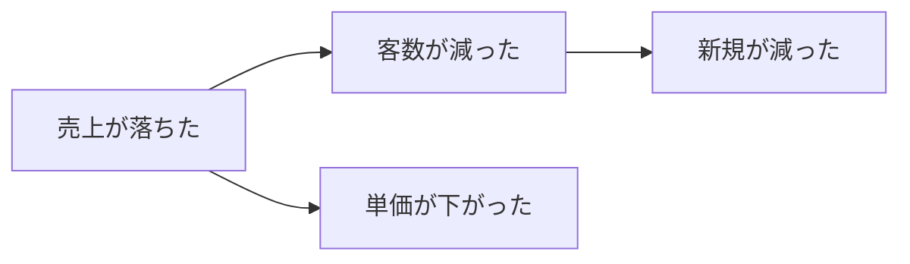

# ロジックツリー M2 設計: Miro のマインドマップとクリップボードで交換する

2026-08-29 / logic-tree-m2

## この文書の位置づけ

ロジックツリーと Miro のマインドマップを、**クリップボード経由で双方向に交換する**機能の設計。
ブレインストーミングでの決定と、実機で行った**11 回の貼り付け実験の結果**を根拠として記録する。

Miro のクリップボード形式は公開仕様が無い。この文書の「[付録] Miro のクリップボード形式」は、
実データの解析と実験だけを根拠にした**この時点での観測結果**である。Miro 側が変えれば壊れる。
壊れたときに何を調べ直せばよいかが分かるよう、**どう確かめたか**まで書いてある。

---

## 1. 目的と範囲

**目的**: Miro でブレインストーミングした結果を facet のロジックツリーへ取り込み、facet で整理した木を
Miro へ戻せるようにする。どちらもクリップボード経由（コピー／貼り付け）で行う。

**対象はロジックツリーだけ**。課題ツリーも木構造だが、今回は対象外とする。

**やらないこと**:

- Miro の API 連携（OAuth・ボード直接操作）。クリップボードだけで完結させる
- 装飾（太字・色・リンク）の保存。ロジックツリーは見た目を持たない設計なので**捨てる**
- Miro 側の位置・サイズの保存。同上（取り込みでは兄弟順の決定にだけ使い、データには残さない）
- 差分同期。取り込みは常に**新しい木を作る**（Miro の ID を facet 側に持ち込まない）

---

## 2. 置き場所と規約

### 2.1 既存の規約5（出力プロファイル）には乗らない

`OutputProfile` は「**Markdown を返す純関数**」と `.md` 書き出しを前提にしている
（`toMarkdown: (data) => string` / `fileSuffix: string`）。Miro 交換は

- 出力が Markdown ではなく **HTML とプレーンテキストの2つ**
- `.md` 書き出しに意味がない
- そもそも**入力（取り込み）の口が規約に存在しない**

ため、無理に押し込むと `toMarkdown` の名前が嘘になり、「Markdown をコピー」のメニューに
Miro が並ぶ。**別の任意スロットとして足す。**

### 2.2 `ToolModule` に任意スロット `clipboardExchanges` を足す

```ts
/** 規約7（任意）: 外部ツールとのクリップボード交換 */
export interface ClipboardExchange<TData> {
  /** 安定識別子。テストと UI の状態が参照する */
  id: string
  /** ボタンの表示に使う名前（例: Miro のマインドマップ） */
  label: string
  /**
   * データ → クリップボードに書くもの。**副作用を持たない純関数**であること
   *（額縁が書き込みを行う。モジュールはクリップボードに触らない）。
   * text を併せて返すのは、HTML だけを載せると他アプリに貼れなくなるため
   */
  toClipboard: (data: TData) => { html: string; text: string }
  /** この HTML は自分の形式か。**ボタンの活性判定で頻繁に呼ぶので速いこと** */
  canImport: (html: string) => boolean
  /** HTML → データ。取り込めないときは人に見せる理由を返す */
  fromClipboard: (
    html: string,
    title: string,
  ) => { ok: true; data: TData } | { ok: false; reason: string }
}
```

`ToolModule` に `clipboardExchanges?: readonly ClipboardExchange<TData>[]` を任意で足す。
**宣言しないツールの規約の点数は増えない**（`describeIssueEffect` と同じ層の任意拡張）。
ロジックツリーだけが宣言し、他の4ツールは何も書かない。

**額縁はツールを名指ししない。** `selectedModule.type === 'logicTree'` と額縁に書くと
rev 6章の構造（額縁はモジュール規約だけを知る）が崩れる。額縁が見るのは
`selectedModule?.clipboardExchanges?.[0]` の有無だけ。

### 2.3 ファイル構成

```
src/modules/logic-tree/
  miro.ts              Miro 形式 ⇄ ロジックツリー。純関数だけ。Tauri も React も知らない
  miro.test.ts         原本バイト列との照合を含む（6.1）
  markdown.ts          Markdown 出力（規約5 の outputs として登録）
  markdown.test.ts
  module.ts            outputs と clipboardExchanges を宣言

src/core/registry.ts        ClipboardExchange 型と任意スロット
src/core/app-controller.ts  取り込み・書き出しの手順（IO は AppIo 経由）

src/components/ChoiceDialog.tsx   onCancel? を任意で足す（5.2）

src/fs/clipboard.ts    readHtml / writeHtml を追加。**ここだけが Tauri を知る**
src-tauri/src/lib.rs   read_clipboard_html コマンド1つ
src-tauri/Cargo.toml   arboard を直接依存に足す
src-tauri/capabilities/default.json  clipboard-manager:allow-write-html を追記
```

### 2.4 Rust 側

```rust
#[tauri::command]
fn read_clipboard_html() -> Result<String, String> {
    arboard::Clipboard::new()
        .and_then(|mut c| c.get().html())
        .map_err(|e| e.to_string())
}
```

`tauri-plugin-clipboard-manager` は **HTML の読み取り API を持たない**
（型定義に `we can read html data only as a string so there's just readText(), no readHtml()` と明記）。
一方その内部で使っている `arboard` 3.6.1 は `Get::html()` を持ち、Windows 実装も
`clipboard_win::raw::get_html` で入っている。**公開されていないだけ**なので自前コマンドで通す。

**`Cargo.toml` へは直接依存として書く。** 推移依存に頼ると、プラグインの更新で黙って消える。

これは rev 12章の「Rust は薄く」の例外ではない。判断もロジックも持たず、ネイティブ API を
渡すだけであり、`allow_skill_dir` / `allow_project_dir` と同じ性格である。復号もパースも
木の組み立ても TypeScript 側で行う。

**書き込みは既存プラグインの `writeHtml(html, altText)` をそのまま使う**ので、Rust の追加は
この1コマンドだけ。

**rev 12章と `src/fs/clipboard.ts` の「読み取り権限は与えない——このアプリにクリップボードを
読む用途は無い」という記述は、この設計で覆る。** 完了時に rev へ反映すること。
なお `clipboard-manager:allow-read-text` は**与えない**（読み取りは自前コマンドを通す）ので、
「プラグインの読み取り権限は持たない」という部分は結果的に保たれる。

---

## 3. 取り込み（Miro → facet）

### 3.1 動線

```
① ウィンドウがアクティブになる
     → read_clipboard_html() → canImport() → ボタンの活性/不活性
② ボタンを押す
     → もう一度読む（活性状態を信用しない）
     → 復号・検証 → 失敗なら理由を出して終わり
③ 三択ダイアログ「新しいファイルに作る」/「このツリーを上書き」/「やめる」
④ 実行
```

**ポーリングはしない。** クリップボードに Miro のデータが載る瞬間は「Miro でコピーして facet に
戻ってくる瞬間」なので、**ウィンドウがフォーカスを得たときに1回読めば足りる**。常時ポーリングは
CPU を食うわりに得るものがない。

**②で読み直す**のは、フォーカス後にユーザーが別のものをコピーしている場合があるため。
「活性なのに押したら何もない」を防ぐ。

**フォーカスの検知は WebView 側の `window` の `focus` イベントで行う**（`AppHost` 経由で
額縁が拾う）。Tauri の window イベントを使わないのは、**コアを Tauri に近づけないため**と、
`focus` は DOM のテストでそのまま発火させられるため。読み取りだけが `AppIo.readClipboardHtml`
として注入される。

**新規ファイルへの取り込みは、額縁の既存経路を通す。** `app-controller.ts` の `createNewFile`
（`createFile` → `addCreatedFile` → `selectFile`）で空のロジックツリーを作り、**その直後に
`onChange(data, null)` で中身を差し替える**。ファイル名の採番・一覧への登録・選択を
自前で再実装しないため。**`createEmpty` の雛形（ルート1件）は捨てられる**が、それでよい。

### 3.2 木の復元

```
1. objects を ns:mindmap を持つものだけに絞る（付箋・図形の混入を捨てる）
2. widgetData.type で ノード("text") と エッジ("line") に分ける
3. エッジから親子を作る: primary.widgetIndex(親) → secondary.widgetIndex(子)
4. 親を持たないノード＝ルート。1つでなければ拒否
5. 循環・自己参照を検出したら拒否
6. 兄弟の並びは _position.offsetPx.y の昇順
7. DFS 行きがけ順で nodes 配列を作る（スキーマの正順）
8. ID は nanoid で採番。Miro の initialId は持ち込まない
```

**6（兄弟順を y 座標で決める）の根拠**: 実データのプレーンテキストの並びが、y 座標の昇順と
完全に一致した。

```
1. 孫ノード１  y=-76      4. 親ノード    y=0
2. 子ノード１  y=-50      5. 子ノード２  y=26
3. 孫ノード２  y=-25      6. 子ノード３  y=76
```

**Miro 自身が「見た目の順」を y 座標で決めている**ということであり、facet が同じ規則を使えば
Miro の見た目と一致する。`objects` の配列順は「ボードでウィジェットを作った順」で、
DFS でも見た目順でもない（実データは `親, 子1, 孫1, 子2, 子3, 孫2`）。**配列順は使わない。**

**8（ID を持ち込まない）の根拠**: `initialId` は**コピーのたびに変わる**ことを実験で確認した
（同じウィジェットが `3458764682045817453` → `3458764682053585457`）。ウィジェットの永続 ID
ではないので、facet 側の同一性の根拠にできない。加えて `node_[A-Za-z0-9]{10}` の ID 規約にも
合わない。**取り込みは常に新しい木を作る。**

### 3.3 断るケースと文言

| 状況 | 文言 |
| --- | --- |
| ルートが2つ以上 | `マインドマップ1つ分を選んでコピーしてください（木が N 本あります）。` |
| ノードが0個 | `マインドマップが見つかりません。Miro でマインドマップを選んでコピーしてください。` |
| 循環がある | `木の形になっていません（ノードが輪になっています）。` |
| 復号に失敗 | `Miro のデータとして読めませんでした。` |

**数を文面に出す。** 何が起きたか分からないまま断られるのが最も困る。「木が3本あります」と
言えば、選択範囲を狭めればよいと分かる。

`ns:mindmap` を持たないオブジェクトは**黙って捨てる**。Miro で範囲選択すると背景の付箋を
巻き込むのは日常的で、そこで断ると使い勝手が悪い。ただし**捨てた結果0個になったら断る**。

### 3.4 文言の変換

Miro のノードは `<p>文言</p>` の HTML。

- `<p>…</p>` を剥がし、**段落が複数なら `\n` で繋ぐ**（`<p>行1</p><p>行2</p>` → `"行1\n行2"`）
- `<br>` も `\n`
- `&amp;` `&lt;` などのエンティティを実体に戻す
- **装飾（太字・色・リンク）は捨てる**

装飾を捨てるのは、facet の `text` に置き場所がないため。スキーマが「位置・幅・折りたたみ状態は
持たない、図はデータから毎回導出する」と定めている通り、ロジックツリーは見た目を持たない。
中途半端に持つと `text` に HTML が紛れ込み、Markdown 出力まで壊れる。

**代償**: Miro で装飾した語は、取り込んで書き戻すと素の文字列に戻る。**これは受け入れる。**

### 3.5 上書きの安全性

上書きは `onChange(next, null)` を1回呼ぶだけにする。`mergeKey: null` は「独立した履歴」の意味
なので、**`Ctrl+Z` 一発で元のツリーに戻る**。

これがあるので、上書きの確認は**三択ダイアログ1枚**で足りる。取り返しがつく操作に確認を
重ねると、確認を読まなくなる方が害が大きい。

**新規ファイルの名前は既存の作法通り**（`module.displayName` ＋連番 = 「ロジックツリー2.json」）。
Miro のデータは名前を持たない（`boardId` だけでボード名もフレーム名も入っていない）ので、
特別扱いする根拠がない。**上書きのときは title を変えない**——中身を差し替えたのであって、
ファイルを取り替えたわけではない。

---

## 4. 書き出し（facet → Miro）

### 4.1 決定した出力仕様

```
autoLayout      true（座標も明示する）
座標            深さ→列 x、葉を上から積んで親は子の中央（tree-layout.ts と同じ考え方）
                COLUMN_GAP=60 / ROW_GAP=16 / 高さ40
幅              文字数から概算（全角16px / 半角9px / 余白28px、最小72）し、
                **列内の最大へ揃える**
高さ            40 固定
色・形          st=28（角あり枠）、#1A1A1A（枠・線・文字）、背景なし（bc=-1, bo=0）、
                中央寄せ（ta="c"）、ffn="Noto Sans"
エッジ          primary=親 / secondary=子、lc=#1A1A1A、ls=2, lt=3
initialId       連番（Miro 側が意味を持たないことは検証済み）
boardId         任意の固定値（実在しなくてよいことは検証済み）
```

`initialId` は `3458764699000000001` から連番、`meta.widgetToken` は `1` から連番、
`boardId` は `"ZmFjZXQtdHI="` を定数で使う（`facet-tr` の base64）。**どれも Miro 側が
意味を持たない**ことは実験4・5 で確認済みで、**固定値にすることでテストの原本照合が成立する**
（実行のたびに変わる値を混ぜると、生成物のバイト比較ができなくなる）。

`boardId` は**実験で通った形式に合わせる**こと——検証に使ったのは `aQ7bKm2ZpTx=` で、
**12文字の妥当な base64** だった。長さや文字種が外れた値（`facetLogicTree=` のような
base64 として不正な文字列）は未検証であり、Miro 側がデコードを試みる可能性がある。
**実装時に、決めた定数で1回だけ実際に貼り付けて確認すること。**

### 4.2 `autoLayout: true` かつ座標も出す、の理由

一見矛盾するが、**両方必要**であることを実験で確かめた。

- **座標を出さない（全ノード `(0,0)`）と、兄弟の順序が壊れる。** Miro が整列はするが、
  順序の根拠がないので逆順になった（指定 A→B→C が表示 C→B→A）
- **`autoLayout: false` にすると、見た目が硬くなる。** 線が直線的で間隔も詰まり、
  マインドマップらしくない
- **座標を出した上で `autoLayout: true` にすると、順序は座標で決まり、見た目は Miro が整える。**
  これが最良だった

### 4.3 幅を列内の最大へ揃える理由

同じ深さのノードの幅がバラバラだと不揃いに見え、木の骨格が読みにくい。既存の
`tree-layout.ts` も「深さごとの最大幅を積み上げて列の x を決める」ので、**同じ最大幅を
そのまま各ノードの幅にも使う**だけで済む。

**幅は広めに倒す。** 広すぎても実害は「枠に余白が出る」だけだが、狭いと Miro 側で折り返して
見た目が崩れる。実験8（全角14 / 半角7 / 余白20）では「枝Aの子1」が2行に折り返した。
実験9 で係数を上げて解消している。

**この概算は外れうる**（フォントの実測手段が facet 側にない）。`ffn: "Noto Sans"` を明示して
いるので簡単には変わらないが、**折り返しが出たら係数を上げる**のが対処である。

---

## 5. UI と動線

### 5.1 額縁のツールバー

```
[取り消す] [やり直す] [Markdown をコピー] [Markdown を書き出す] [Miro へコピー] [Miro から取り込む]
```

**4ボタンとも常に出ていて、消えたり出たりしない**（`ExportMenu` の既存原則）。

| ボタン | 活性の条件 |
| --- | --- |
| Markdown 系 | ファイルを開いていて、そのツールが `outputs` を持つ（ロジックツリーは M2 から活性） |
| Miro へコピー | 開いているツールが `clipboardExchanges` を持つ |
| Miro から取り込む | 同上 **かつ** クリップボードに Miro のマインドマップがある |

### 5.2 取り込みの三択

既存の `ChoiceDialog` を使う。ただし**あれはキャンセルも Esc も持たない**設計である
（どちらを選んでも副作用があり、宙ぶらりんが残る場面のために作られた）。取り込みは
**やめる**という選択が要るので、`onCancel?` を**任意で**足す。既存の呼び出し側（外部変更の衝突）は
渡さないので、**そちらの挙動は変わらない**。

```
┌──────────────────────────────────────────────┐
│ Miro のマインドマップを取り込む                 │
│                                              │
│ ノード 7 個のマインドマップが見つかりました。     │
│ どちらに取り込みますか。                        │
│                                              │
│   [やめる] [新しいファイルに作る] [このツリーを上書き] │
└──────────────────────────────────────────────┘
```

**ノード数を出す。** 押す前に「意図した選択範囲か」を確かめられる。7個のつもりが2個なら
選択し直せる。

取り込めないときはダイアログを出さず、既存の `IssueBanner` ／トーストで理由を出す（3.3）。

---

## 6. Markdown 出力（規約5）

ロジックツリーは `outputs: []` のままだった（M1 の「M2 で足す」が今回にあたる）。
**プロファイル1本**にし、シーケンスの決着に倣って**図と箇条書きを縦に並べる**
（形式の軸でプロファイルを割らない）。

````markdown
## 意思決定のロジックツリー



- 売上が落ちた
  - 客数が減った
    - 新規が減った
  - 単価が下がった
````

- **`h1` は使わない**（NotePM のページタイトルと階層が衝突する）。`title` が h2
- 図は **`flowchart LR`**。`mindmap` 記法は Mermaid 10 以降でしか描けないので使わない
- ノード ID は `n1`, `n2` … の連番（`node_xxx` は長すぎて図の可読性を損なう）
- **空文言は `（未定義）`**（用語集・シーケンスと同じ規約）
- `[` `]` `"` はエスケープする

---

## 7. テスト

### 7.1 【最重要】書き出しは原本バイト列と照合する

**エクスポートの壊れ方は、インポートのテストでは検出できない。**

今回まさにこれを踏んだ。`data-meta` の閉じタグ `(/miro-data-v1)-->` を落としていたが、
**復号は素通りした**（base64 デコードが末尾の余分な文字を黙って捨てるため）。往復テスト
（facet → Miro 形式 → facet）でも通ってしまう。3回の貼り付け実験を空振りさせた原因である。

したがって:

- **原本の CF_HTML バイト列を固定データとしてテストに持ち、生成物と `Buffer.equals` で照合する**
- 検証済みの原本は 9,768 バイト。実際に「原本の JSON を自前エンコーダに通して原本のバイト列を
  完全再現できる」ことを確認してある

### 7.2 その他

| 対象 | 見るもの |
| --- | --- |
| 復号 | 実データから木が復元できる（親6ノード5エッジ → 期待する親子関係） |
| 兄弟順 | y 座標の昇順で並ぶ。**エッジの出現順とわざと食い違う固定データ**で確かめる |
| 拒否 | 森（ルート2つ）／循環／ノード0個／復号失敗の4つが、それぞれの文言で断られる |
| 混入 | `ns:mindmap` を持たないオブジェクトが捨てられ、残りで木ができる |
| 文言 | 複数段落 → `\n`、`<br>` → `\n`、エンティティの復元、装飾の除去 |
| レイアウト | 列 x・y の計算、列内の幅揃え |
| Markdown | `flowchart` のエスケープ、空文言の `（未定義）`、`h1` を使わないこと |
| 額縁 | 活性条件（`clipboardExchanges` の有無、クリップボードの中身）、三択の3経路 |

---

## [付録] Miro のクリップボード形式（2026-08-29 時点の観測）

### 器

Windows の **`HTML Format`（CF_HTML）**。ヘッダのオフセットは**バイト位置**。

```
Version:0.9\r\nStartHTML:0000000105\r\nEndHTML:0000009768\r\n
StartFragment:0000000141\r\nEndFragment:0000009732\r\n
<html>\r\n<body>\r\n<!--StartFragment-->〈フラグメント〉<!--EndFragment-->\r\n</body>\r\n</html>
```

`UnicodeText` にも各ノードの文言が入るが、**構造は無く、y 座標順に並んでいるだけ**なので読まない。

`Chromium internal source RFH token` / `Chromium internal source URL` は**不要**
（付けずに書き戻した原本が問題なく貼れた）。

### フラグメント

```html
<span data-meta="〈本体〉"></span><div><div><div>文言</div></div></div>
<div>…</div>
```

`<div>` の区切りは **`\n`**（`\r\n` ではない）。`<div>` 側は表示用で、構造は持たない。

### 本体の符号化

```
<--(miro-data-v1)〈base64〉(/miro-data-v1)-->

JSON → UTF-8 → 各バイトに +59 (mod 256) → base64      符号化
base64 → 各バイトから −59 (mod 256) → UTF-8 → JSON    復号
```

**閉じタグ `(/miro-data-v1)-->` は復号では無視されるが、符号化では必須。**

### JSON

```json
{ "isProtected": false, "boardId": "…", "data": { "objects": [ … ], "meta": {} },
  "version": 2, "host": "miro.com", "asPortalAmount": 0, "copierType": "COPY" }
```

`objects` は**ノードとエッジが混在した1本の配列**。`widgetData.type` で見分ける。

**ノード** (`"text"`):

```json
{ "widgetData": { "json": {
    "_position": { "offsetPx": { "x": -189, "y": 0 }, "schema": "canvasOffsetPx" },
    "scale": { "scale": 1 }, "relativeScale": 1,
    "rotation": { "rotation": 0 }, "relativeRotation": 0,
    "size": { "width": 121, "height": 64 },
    "_parent": null,
    "text": "<p>親ノード</p>",
    "style": "{\"st\":15,…}" },
  "type": "text" },
  "type": 14,
  "ns:mindmap": { "theme": "colorBranch", "layout": "butterfly", "autoLayout": true,
                  "collapsibleBranch": { "isBranchCollapsed": false, "isNodeHidden": false } },
  "id": 0, "initialId": "3458764682045817453",
  "meta": { "boardId": "…", "widgetToken": 333 } }
```

**エッジ** (`"line"`):

```json
{ "widgetData": { "json": {
    "points": [],
    "primary":   { "point": { "x": 1, "y": 0.5 }, "positionType": 0, "widgetIndex": 0 },
    "secondary": { "point": { "x": 0, "y": 0.5 }, "positionType": 0, "widgetIndex": 1 },
    "_position": null, "_parent": null,
    "style": "{\"lc\":16729572,…}",
    "line": { "captions": [] } },
  "type": "line" },
  "type": 14, "ns:mindmap": { "mindmap": true }, "id": 2, … }
```

`widgetIndex` は **`objects` 配列のインデックス**を指す。`primary` が親、`secondary` が子。

### `style` の値（10進の色）

| キー | 意味 | 観測値 |
| --- | --- | --- |
| `st` | 形状プリセット | 14=枠なし / 15=角丸（スタジアム形）/ 27=角丸 / **28=角あり四角** / 29=角丸四角 |
| `bc` / `bo` | 背景色 / 背景の不透明度 | `-1` は色なし |
| `brc` / `bro` / `brw` / `brs` | 枠の色 / 不透明度 / 太さ / スタイル | `bro:0` で枠が消える |
| `tc` | 文字色 | `1710618` = `#1A1A1A`（Miro の標準の黒） |
| `ta` | 揃え | `"c"` 中央 / `"l"` 左 |
| `lc` | 線の色（エッジ） | 枝ごとに変わる |

`theme: "colorBranch"` は**貼り付け時には効かない**。色を指定しなければ全部黒になる
（実験6 で確認）。**枝の色が要るなら facet が持つ必要がある**が、今回は黒単色にしたので不要。

### 任意でよいと判明した値

| 値 | 根拠 |
| --- | --- |
| `initialId` | でっちあげた値で貼れた。**コピーのたびに変わる**ことも確認済み |
| `meta.widgetToken` | 同上 |
| `boardId` | 実在しない値（`aQ7bKm2ZpTx=`）で貼れた |

### 順序について

**選択順はデータに影響しない。** バラバラの順で選択してコピーしたデータが、
前回のコピーと1バイトも違わなかった。Miro は選択順を捨てて正規化している。

---

## [付録] 実験の記録

| # | 変えたもの | 結果 |
| --- | --- | --- |
| 1 | `initialId` と `meta` を削除、木も自作 | ✗ テキストになる |
| — | **原本を1バイトも変えず書き戻し** | ✓ マインドマップ |
| 2 | でっちあげた `initialId` と `meta` | ✗ |
| 3 | 実験2 ＋ `boardId` を別値に | ✗ |
| — | **自前エンコーダで原本を再生成し、バイト比較** | **閉じタグの欠落を発見。9,768 バイト完全一致を確認** |
| 4 | 実験2 ＋ 閉じタグ修正 | ✓ **犯人は閉じタグだけだった** |
| 5 | 実験4 ＋ `boardId` を別値に | ✓ `boardId` は任意でよい |
| 6 | `style` を全削除、枝3本・2段 | ✓ 貼れるが**全部黒・枠なし**。`theme` は効かない |
| 7 | 全ノードの座標を `(0,0)`、`autoLayout: true` | 整列はするが**兄弟の順序が逆になる** |
| 8 | 座標計算 ＋ `autoLayout: false` ＋ `st=28` 黒 | ✓ 順序は正しいが**幅不足で折り返し**、見た目が硬い |
| 9 | 実験8 ＋ 幅の係数を上げ、中央寄せ | ✓ 折り返し解消。見た目はまだ硬い |
| 10 | 実験9 ＋ `autoLayout: true` | ✓ **順序も見た目も良い** |
| 11 | 実験10 ＋ 幅を列内の最大へ揃える | ✓ **決定** |

**手順を誤った記録**: 実験1〜3 は、**自前エンコーダを検証する前に内容を変えた**ために空振りした。
原本の完全再現（バイト比較）は最初にやるべき確認だった。同種の外部形式に手を出すときは、
**まず原本を自分の経路で再現できるかを確かめる**こと。
