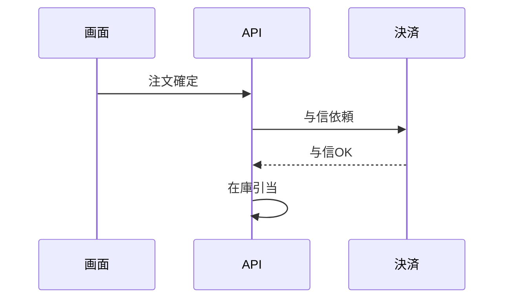

# シーケンスエディタ M3 設計: マウス操作（ドロップダウン）＋ 出力

作成日: 2026-08-11
前提資料: [`../../sequence/sequence-design-notes.md`](../../sequence/sequence-design-notes.md)（論点3・8・9・11・12）／[`../../sequence/sequence-m1-scope.md`](../../sequence/sequence-m1-scope.md)／[`../../history/sequence-m1-keyboard-editor.md`](../../history/sequence-m1-keyboard-editor.md)／[`../../history/sequence-m2-usability.md`](../../history/sequence-m2-usability.md)／[`../../open-issues.md`](../../open-issues.md)／[`../../lessons-for-planning.md`](../../lessons-for-planning.md)
用途: `/superpowers:writing-plans` への入力。**実装計画の対象範囲は本ファイルが正**とする

---

## この段階の目的

**打ち終えたシーケンスを NotePM に出せるようにし、キーボードを覚えていない人でも from / to / 種別を選べるようにする。**

sequence M1 は「キーボードだけで打ち切れるか」、M2 は「会議で使ったときの使い勝手」を扱った。M3 は**打った後（出力）と、打つ人を選ばないこと（マウス）**の2つを扱う。

design-notes 論点12 の M3+ は6候補（ゾーン／`Tab` の2ゾーン化／マウス操作／出力／`errorRefs`／`replyTo`）を並べ、順序は「実使用が決める」としていた。**M3 はこのうちマウス操作と出力の2つを採り、ゾーンを M4 とする。**

---

## 含むもの（IN SCOPE）

### 1. 出力（Markdown 表 ＋ Mermaid）

#### 1-1. プロファイルは1本

```ts
outputs: [{ id: 'default', label: 'Markdown', fileSuffix: '', toMarkdown: sequenceToMarkdown }]
```

用語集と同形（`fileSuffix: ''`）。出力は `## タイトル` → Mermaid ブロック → 失敗考慮の表、の縦1本。

**形式（表／図）をプロファイルの軸にしない。** rev 6章のプロファイルは「読み手による出し分け」の軸であり（M9 でエラーカタログがサポート向け／開発向けに分けた）、形式の軸を混ぜると、後から読み手の軸が要るときに掛け算になる。図と表を1本にまとめることで、`No` で図と表を突き合わせられる利点もある。

出力の全体像（`~~~` は実際には ``` ）:

~~~text
## 注文確定（在庫あり）



| No | from → to | ラベル | 失敗確定 | 結果不明 | 実行済みなら |
| --- | --- | --- | --- | --- | --- |
| 1 | 画面 → API | 注文確定 | 画面にエラー表示して中断 | （未定義） | （未定義） |
| 2 | API → 決済 | 与信依頼 | 中断してロールバック | 1回だけ再試行 | 取引IDで冪等性を担保 |
| 3 | 決済 → API | 与信OK |  |  |  |
| 4 | API（内部処理） | 在庫引当 | ─ 考慮不要（在庫は事前確保済み） |  |  |
~~~

#### 1-2. 表

- 列は `No` ／ `from → to` ／ `ラベル` ／ `失敗確定` ／ `結果不明` ／ `実行済みなら`（design-notes 論点11 の列構成）
- **`No` はデータ配列の位置（`index + 1`）。** エラーカタログの規約と同じで、グループ分けもソートもしない。**M2 で入れたガターの行見出し `#N` と一致する**ので、会議で「3番の結果不明が空だ」と口頭で指せる
- `from → to` 列: `call` / `reply` は `画面 → API`、`self` は `API（内部処理）`
- セルのエスケープは `@/core/markdown-table` の `escapeCell`（`|` のエスケープと改行の `<br>` 変換を既に持つ）。見出しは `headingText`

**セルの表記**（画面の `GutterSlot` の3状態を写す）:

| 状態 | 画面 | 出力 |
| --- | --- | --- |
| `handled` | 通常の文字 | 本文 |
| `notApplicable`（理由あり） | `─` 接頭＋弱い文字色 | `─ 考慮不要（在庫は事前確保済み）` |
| `notApplicable`（理由なし） | 同上 | `─ 考慮不要` |
| 未回答（問いは立っている） | warning の面＋「未定義」 | `（未定義）` |
| **問いが立っていない** | **スロットそのものが無い** | **空セル** |

最後の行だけが新しい判断である。画面には「スロットが無い」という表現があるが、表は格子なので必ずセルが存在する。**空セルにする。** 人が判断したセル（本文 / `─ 考慮不要` / `（未定義）`）は必ず何かが入るので、空白は自動的に「ここは問われていない」の意になる。**埋まっているセルの密度がそのまま「考えどころの多さ」に見える**という副次効果もある。

`─`（線だけ）は採らない。`─ 考慮不要` と接頭が同じになり、**人が決めた**（`notApplicable`）と**ツールが問わない**（立っていない）の境が潰れる。`（問われない）` のような明示も採らない——`reply` 行が3列ともその文字で埋まり、表が騒がしくなって密度の読み取りが効かなくなる。

#### 1-3. Mermaid

- `sequenceDiagram`。**正常系のみ**（design-notes 論点11。失敗考慮は Mermaid に出さない）
- participant の ID は **`actors` の配列位置ベース**（`a1`, `a2`…）＋ `as` で表示名。`actor_Xp2mQ9rT4k` をそのまま吐くと `as` により図には出ないがソースが読めなくなる
- 矢印は `kind` × `awaitsReply` から導出（論点8・11 で確定済み）:

| ステップ | Mermaid |
| --- | --- |
| `call` + `awaitsReply: true` | `a1->>a2: ラベル` |
| `call` + `awaitsReply: false` | `a1-)a2: ラベル` |
| `reply` | `a1-->>a2: ラベル` |
| `self` | `a1->>a1: ラベル` |

- **`domain`（責任境界）は出力に出さない。** 理由は下記「4. domain の扱い」

#### 1-4. 壊れたデータの扱い

整合性検証はレベル2（受け入れて赤表示）なので、**参照切れのファイルも開けて出力を押せる**。ここで Mermaid の構文が壊れると、図は部分的に崩れるのではなく**丸ごと描画されない**（`call` に `to` が無いときの `a1->>: ラベル` は実際に構文エラー）。

**二重に守る。**

**(a) 出力に `（未解決）` 参加者を1つ立てる。** 解決できない参照（`from` / `to` が `actors` に無い、`call` / `reply` に `to` が無い）は全部そこへ向ける。**行は1本も落とさず、構文も壊れず、貼った先の NotePM でも「（未解決）」のライフラインが立って異常が見える。** 表の `from → to` 列も同じ語で揃える。

行を Mermaid から省く案は採らない。`markdown.ts` の既存コメントが書いているとおり、**「仕様書に貼った瞬間に見えなくなる」のは文章仕様書の悪癖の再生産**である。

**(b) 額縁に確認ダイアログを入れる。** 整合性エラーがあるファイルの出力（コピー・書き出しの両方）に確認を挟む。

`toMarkdown` は規約で「副作用を持たない純関数」なのでダイアログは中から出せない。**額縁（`App.tsx` / `app-controller`）の側に置く＝4ツール全部に効く挙動になる。** これは意図した範囲で、「赤が出ているファイルをそのまま仕様書として配る」は用語集の ID 重複でも同じ問題である。

**未定義には出さない。** 未定義（`failures` のキー欠落・空フィールド）は出力に `（未定義）` として残すのが既存の規約であり、正常な「まだ決めていない」状態である。確認を挟むのは**整合性エラー（赤）だけ**——判定は `App.tsx` が既にエディタへ渡している `selected.issues`（`App.tsx:398`）が空でないこと。

**ダイアログの文面はモジュールから受け取る。** 「そのまま出力すると何が起きるか」はツールごとに違う（用語集の ID 重複と、シーケンスの参照切れでは出力に起きることが別）。`OutputProfile`（規約5 の中身）に任意のスロットを1つ足す:

```ts
/**
 * 整合性エラーがあるまま出力したとき、出力に何が起きるかの1文。
 * 額縁の確認ダイアログが本文の末尾に足す。持たないツールは汎用文だけになる
 */
describeIssueEffect?: (issues: readonly ConsistencyIssue[]) => string
```

`ToolModule` の点数は7点のまま変えない（M9 が規約5 を複数プロファイルへ拡張したのと同じ層の拡張）。`open-issues.md` が予約している「モジュール規約8（表記ゆれ検知の対象フィールドパス宣言）」の枠とは無関係。

出るダイアログ:

> **整合性エラーのあるファイルを出力します**
>
> このファイルには整合性エラーが 2 件あります。
> ・ステップ3: `from` が参照している参加者が存在しません
> ・ステップ7: 呼出なのに `to` がありません
>
> このまま出力すると、図には「（未解決）」という参加者が立ち、該当する矢印はそこへ向きます。表には全行がそのまま出ます。
>
> ［キャンセル］［出力する］

`AlertDialogDescription` は `<p>` なので、改行を出すには `whitespace-pre-line` が要る。

#### 1-5. Mermaid の正規化関数は `src/modules/sequence/` に置く

Mermaid のラベルは改行を含められず、`#` はエンティティ記法（`#35;`）の開始文字である。表の側は `escapeCell` が既に持っているので、**新規に要るのは Mermaid 用だけ**。

design-notes 論点11 は「先に出力を実装した側が正規化関数を1本立て、後発がそれに乗る」としているが、**置き場はモジュール内（`src/modules/sequence/mermaid.ts`）にする。** `markdown-table.ts` 自身が用語集で生まれて M10 の2本目でコアへ引き上げられた経緯があり、このリポジトリは M9 決定1・M10 の意図的複製と一貫して「1本目では抽象を作らない」で通っている。`open-issues.md` に「logic-tree の出力を作るとき `core/mermaid.ts` へ引き上げる」と書き残す。

### 2. マウス操作（ドロップダウン）

#### 2-1. 種別セル → `DropdownMenu`

`StepShapeCell` は `button` なので Radix の `DropdownMenu`（`src/components/ui/dropdown-menu.tsx` が既存。`ExportMenu` が使用中）がそのまま乗る。4項目（呼出／呼出（応答なし）／応答／内部処理）を出す。

**M2 の決定を1つ上書きする。** M2 の設計確定事項5「形セルのクリック切替」が入ったばかりだが、クリックが「開く」になるので**クリック巡回は消える**。4値に対して最大3クリックが1クリックになるので上位互換だが、1マイルストーン前の決定の反転なので申し送りに明記する。**`↑↓` の巡回はキーボード側にそのまま残す。**

`StepShapeCell.tsx:15` のコメント「`select` 要素にしないのはネイティブのドロップダウン UI がキャンバスの transform の外に出るため」は、**ネイティブ `select` の否定であってポップアップ自体の否定ではない。** Radix は portal ＋ anchor の `getBoundingClientRect` で画面座標に出すので、transform 下の要素でも位置は正しく、ズームで拡大縮小もしない（等倍で読める側に倒れる）。コメントは実装に合わせて書き換える。

#### 2-2. from / to → 選択専用のドロップダウン

**`ActorRefCell` からテキスト入力・ドラフト確定・照合（`normalizeForMatch`）・インライン参加者作成を外し、`StepShapeCell` と同じ `button` ＋ `DropdownMenu` にする。** 候補は `actors` の配列順。`↑↓` の即時切替は残す。`commands.ts` の `createActorAndAssign` は呼び出し元が消えるので削除する。

**これは M1 の確定事項2件の反転である**（design-notes 論点9 と `sequence-m1-scope.md` の「頭文字のインクリメンタル一致＋未登録名の確定でその場で `actors` に追加」）。根拠は実使用の観察で、**補完の出番が少なく、参加者をその場で作る必要も感じられなかった**というもの。M1 の実機確認チェックリスト自体が「曖昧な前方一致の確定で、打ちかけの短い名前の参加者が生えないか（「決」＋Enter で参加者「決」ができる挙動の観察）」を危険として見に行っており、観察と整合する。

副次的に消えるもの:

- **照合規則が2つになる問題**（`datalist` を検討した際に浮上した論点）。`normalizeForMatch` への依存ごと消える
- **`Enter` の二重経路の危険**（lessons-for-planning に「同じイベントが2つの経路を通る UI 部品」の教訓として記録されている、`ActorRefCell` の `commit()` と `insert-item-after` の取り合い）。ドラフト確定が無くなるので構造的に消滅する。**教訓そのものは残す**（記録は書き換えない）

#### 2-3. 「参加者を追加」ボタンを足す

インライン作成を外すと、**マウスだけの人が2人目以降の参加者を作る手段がゼロになる。** 現在の参加者作成経路は2本しかない:

1. 空状態の「クリックして開始」（最初の1人）
2. 参加者ヘッダにフォーカスして `Enter`（`SequenceEditor.tsx:486`。キーボードのみ、ボタンは無い）

M2 で入れた「ステップを追加」ボタンの隣に**「参加者を追加」ボタン**を1つ足す（`addActorAfter` は既にある）。M3 はマウスの回なので、ここが空いたまま出てはならない。

#### 2-4. ポップアップが開いている間はキャンバスを止める

Radix のポップアップは scroll と resize は追うが **transform の変化は追わない**。開いたままズームすると位置がずれる。

`useViewport(ref, enabled)` の `enabled` を false にし、あわせて **`filter` が `enabled` を見るよう直す**（`open-issues.md` の記述どおり「`filter` の先頭に `enabled` の ref を見る1行を足すだけ。`enabled` を ref に写す必要がある——d3 のハンドラはマウント時に1回しか張らないため」）。

**logic-tree 側も同時に直す。** `open-issues.md` の複製の項が「差分を作らない。直すときは両方を直す」と命じているため。これは複製の解消ではなく、複製規約の遵守である。

これで `open-issues.md` の「モーダルが開いている間もキャンバスのホイール／ドラッグが生きている」が解消する。

### 3. ゾーンは M4 とする

design-notes 論点12 の M3+ 行と `open-issues.md` に「ゾーンは sequence M4」と明記する。M3 に含めない理由:

1. **`schemaVersion` 改訂＋マイグレータを伴う唯一の候補。** `schema.json` / `questions.ts`（束ねたステップの問いはどうなるか）/ `consistency.ts`（新ルール）/ `layout.ts`（背景帯）/ ガター集計、と縦に全層を貫く
2. **データ形式が未確定。** design-notes は「範囲の表現（step ID のペアか、ステップ側の所属宣言か）はゾーンを設計するマイルストーンで決める」と持ち越している
3. **マウスと出力の設計を書き換える。** ゾーンがあると「出力の表にゾーン列が要るか」「範囲選択はマウスでやるのか」が生まれる。未確定の土台の上に他の2本を建てることになる
4. design-notes がゾーンに付けた条件——「**『同じ答えを何度も書いた』実感を得てから**」——を満たした記録がまだ無い

### 4. `domain` の扱い

**M3 の出力は `domain` を見ない。** 画面の境界線はそのまま残す。

あわせて **`open-issues.md` に「`domain` の存置を見直す」を1項目立てる。** 理由は、`domain` が設計セッションの途中で役割を失っているためである。論点3 の当初の構想では境界跨ぎが問いの導出に効くはずだったが、結論は「`ifExecuted` は `awaitsReply: true` なら境界に関係なく常に立つ」であり、論点4 はそれを受けてこう書いている:

> なお `ifExecuted` を境界に関係なく常に立てると決めたため、**境界は問いの導出に一切関与しない**。`domain` の用途は境界線の描画のみ（「時系列＋責任境界」の看板は描画で残る）。

つまり `domain` は現在、rev 2章の一行を裏切らないためだけに残っている属性である。**UML のシーケンス図に「境界」という標準概念は無い**（スイムレーンはアクティビティ図の話）ことも、この見直しを支持する。M3 では判断せず、議題として立てるにとどめる。

---

## 含まないもの（OUT OF SCOPE）

- **ゾーン**（`zone_`・範囲束ね・背景帯・範囲選択 UI）——M4
- **`Tab` の2ゾーン化**（骨格ゾーン→答えゾーン）——`open-issues.md` に残したまま
- **`errorRefs`（エラーカタログ参照）・`replyTo`・用語集参照（`term_`）**
- **ドロップダウン以外のマウス操作**: ドラッグでのステップ・参加者の並び替え、ホバーの「+」ハンドル、右クリックメニュー、矩形選択・複数選択、複製。答えスロットの3状態のマウス切替も含まない（`Ctrl+Enter` のまま）
- **ステップ削除のマウス手段**（行の削除ボタン）。`open-issues.md` の「空欄 `Backspace` の誤爆の不安」は残したまま
- **出力の作り込み**: 出力プレビュー、出力プロファイルの追加、`domain` の出力表現
- **`core/canvas` への一般化**（別マイルストーン）。`viewport.ts` / `useViewport.ts` / `measure.ts` / `seq-font.ts` の複製に**差分を作らない**——2-4 の `filter` 修正は logic-tree と sequence の両方に同じ形で入れる
- **`SequenceEditor.tsx`（1044行）の分割**。今回触る範囲に限った整理は行ってよいが、分割そのものを目的にしない

---

## 完了条件（動作で判定する）

1. 会議1回分のシーケンスから Markdown をコピーし、NotePM に貼って**図が描画され、表が読める**
2. **参照切れのあるファイルで出力すると確認ダイアログが出る**。続行すると図に「（未解決）」の参加者が立ち、行は1本も落ちていない
3. **マウスだけで from / to / 種別を選べ、参加者とステップを追加できる**
4. **`SequenceEditor.dom.test.tsx` の `Tab` 移動順・`Enter` でのステップ追加・IME 誤爆防止のテストが、1行も変更されずに緑**（キーボード動線を壊していないことの証拠）。
   `ActorRefCell.dom.test.tsx` は部品が `input` から `button` に変わるため書き換わるが、**`↑↓` の即時切替という検証対象そのものは残す**——照合・ドラフト確定・インライン作成のテストだけが消える
5. **ドロップダウンを開いている間、`Ctrl+ホイール` でキャンバスが動かない**（logic-tree でも同じく動かない）
6. Mermaid 生成・表生成・正規化関数のユニットテストが通る

---

## 計画作成時の指示

- 本ファイルの IN SCOPE のみを対象とすること。OUT OF SCOPE を「ついでに」含めないこと
- [`../../lessons-for-planning.md`](../../lessons-for-planning.md) を必ず読むこと。特に本マイルストーンで効くもの:
  - **退化ケースをテストデータに選ばない。** 出力のテストデータは**参加者3人以上・`call`（待つ/待たない）・`reply`・`self` を混在・`（未解決）` を1件含む**形にする。「隣の実装でも同じ値になるか」を期待値ごとに問う
  - **既存の機械検査が新設ファイルを走査対象に含むか確かめる手順を1つ入れる**（`palette.test.ts`。同じ穴が2回続いている）
  - **改修対象は件数ではなくファイルパスの一覧で列挙する。** 特に `useViewport.ts` の `filter` 修正は logic-tree と sequence の2本
  - **実機確認は人間の独立タスクにし、ドキュメント反映と束ねない**
  - **`aria-label` を足したら、既存テストの前方一致クエリと衝突しないか grep する**
  - テストの件数を計画に書かない
- **実機確認チェックリストの先頭に「ズーム 0.4x と 2.5x の状態で、ドロップダウンが正しい位置に等倍で出るか」を置く。** Radix の portal が transform 下の anchor をどう扱うかは、この環境では実物でしか確かめられない（M1 の「ライブラリの既定値は実物で確かめる」の教訓）
- 額縁への出力の登録は `module.ts` の `outputs` に1本足すだけで済むはず（M6・M9・M10 で実証済み）。済まない場合は計画の誤りとして報告すること
- ダイアログの追加は額縁（`App.tsx` / `app-controller`）の変更であり、**4ツール全部の出力経路に効く**。既存3ツールの出力テストが落ちないことを確認する手順を入れること

---

## マイルストーン完了時に触るもの（CLAUDE.md の3箇所）

1. **`docs/history/sequence-m3-mouse-and-output.md` を新規作成**
2. **`docs/open-issues.md` を編集**
   - 消す: 「モーダルが開いている間もキャンバスのホイール／ドラッグが生きている」／「actor / kind セルをドロップダウン化する案」
   - 足す: 「Mermaid 正規化関数を `core/mermaid.ts` へ引き上げる（logic-tree の出力を作るとき）」／「`domain` の存置を見直す」／「ゾーンは sequence M4」
   - 残す: 「`replyTo` が無い」「`GhostSlot` の ✕ が `layout.totalWidth` の外へはみ出す」「`Tab` の2ゾーン化」「空欄 `Backspace` の誤爆の不安」
3. **`docs/overview-rev.md` へ反映**（6章の出力プロファイル規約に `describeIssueEffect` を追記。2章のシーケンスの一行に出力を追記）＋ 教訓があれば `docs/lessons-for-planning.md` に追記
4. **`docs/sequence/sequence-design-notes.md` は記録なので書き換えない。** 論点12 の M3+ 行の更新は、`open-issues.md` と本 spec の側で担う
